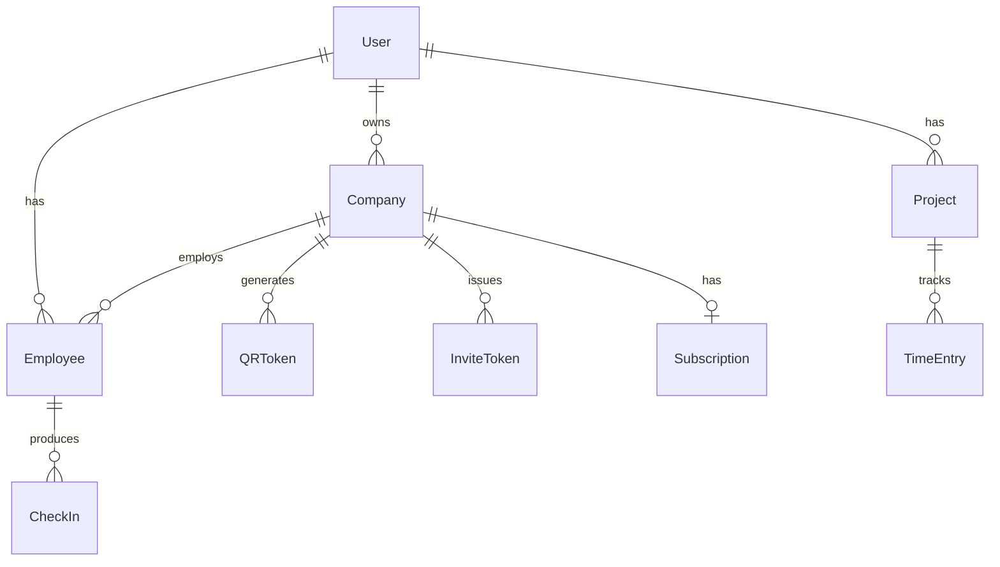

# Database

Work Tact uses **PostgreSQL 16** with **Prisma 5** as the ORM. Schema lives at `packages/database/prisma/schema.prisma` — shared across backend, seed scripts, and any workers that need typed database access.

The `@worktime/database` package exports the generated Prisma Client; no other package should import `@prisma/client` directly.

## Why Postgres

See [ADR 0001: Postgres as Source of Truth](../../docs/adr/0001-postgres-as-source-of-truth.md).

Short version: strong relational guarantees, JSON/JSONB escape hatch for flexible fields, mature ecosystem (pg_stat, PITR, logical replication), first-class Prisma support, and excellent geospatial extensions (PostGIS) available when we need better geofencing than haversine-in-app.

## Commands

| Command | Purpose |
|---------|---------|
| `pnpm db:generate` | Generate Prisma client types into `node_modules/.prisma/client` |
| `pnpm db:push` | Push schema to dev DB without creating a migration (fast iteration) |
| `pnpm db:migrate` | Create + apply a new migration in dev (`prisma migrate dev`) |
| `pnpm db:seed` | Seed deterministic demo data (idempotent) |
| `pnpm db:studio` | Open Prisma Studio UI at `http://localhost:5555` |
| `pnpm --filter @worktime/database exec prisma migrate deploy` | Apply pending migrations in prod (no prompts) |
| `pnpm --filter @worktime/database exec prisma migrate reset` | Drop + recreate + seed (dev only) |

All commands run against the `DATABASE_URL` env var. See `.env.example` for the local development URL.

## ERD



Legend:
- `||--o{` — one-to-many (mandatory on left, zero-or-many on right)
- `||--o|` — one-to-zero-or-one (Subscription is optional per Company)

## Models

### User

Primary identity. Tied to a Telegram account — authentication happens exclusively via Telegram Login Widget / Mini App initData, so `telegramId` is the canonical auth key.

| Field | Type | Notes |
|-------|------|-------|
| `id` | `String` | `@id @default(cuid())` — primary key |
| `telegramId` | `BigInt` | `@unique` — primary auth key; BigInt because Telegram IDs can exceed 2^31 |
| `phone` | `String?` | Optional; populated only if user shares contact in bot |
| `firstName` | `String` | Required — Telegram always provides it |
| `lastName` | `String?` | Optional — not all Telegram users set one |
| `username` | `String?` | Telegram `@handle` if any; no `@` prefix stored |
| `avatarUrl` | `String?` | From Telegram `getUserProfilePhotos`; may be stale if user changed photo |
| `createdAt` | `DateTime` | `@default(now())` |
| `updatedAt` | `DateTime` | `@updatedAt` |

**Relations**
- `employees Employee[]` — memberships in companies (a user may belong to multiple companies)
- `ownedCompanies Company[]` — companies where this user is the owner
- `projects Project[]` — B2C solo-freelance projects owned by this user

**Notes**
- No email field — intentional. Telegram is the only auth surface today. If/when web-only signup lands, add `email String? @unique` plus a new `AuthMethod` enum.
- `telegramId BigInt` requires `BigInt` handling in JSON responses; backend serializes as string via a global interceptor.

### Company

A business tenant. Has exactly one owner (a `User`) and many `Employee` memberships. Geofencing, timezone, and work-hour defaults live here.

| Field | Type | Notes |
|-------|------|-------|
| `id` | `String` | `@id @default(cuid())` |
| `name` | `String` | Display name |
| `slug` | `String` | `@unique` — URL-safe identifier, used in dashboard URLs |
| `ownerId` | `String` | FK → `User.id` |
| `owner` | `User` | Relation via `ownerId` |
| `address` | `String?` | Human-readable address |
| `latitude` | `Float?` | Center of geofence |
| `longitude` | `Float?` | Center of geofence |
| `geofenceRadiusM` | `Int` | `@default(150)` — radius in meters for valid check-ins |
| `timezone` | `String` | `@default("Europe/Moscow")` — IANA zone |
| `workStartHour` | `Int` | `@default(9)` — 24h local hour |
| `workEndHour` | `Int` | `@default(18)` — 24h local hour |
| `createdAt` | `DateTime` | `@default(now())` |
| `updatedAt` | `DateTime` | `@updatedAt` |

**Relations**
- `employees Employee[]`
- `qrTokens QRToken[]`
- `inviteTokens InviteToken[]`
- `subscription Subscription?` — at most one; created lazily on first paid upgrade

**Notes**
- `latitude`/`longitude` are nullable because companies can be created before geofence setup; backend refuses to enforce geofence when either is null.
- `workStartHour`/`workEndHour` are integers — no minute-level granularity today. If that becomes needed, add `workStartMinute` / `workEndMinute` or switch to `String` (`"09:30"`).
- Overnight shifts (e.g. 22-06) are allowed: treated as "end wraps next day".

### Subscription

Billing state for a Company. Optional — a Company without a Subscription is on the implicit free tier.

| Field | Type | Notes |
|-------|------|-------|
| `id` | `String` | `@id @default(cuid())` |
| `companyId` | `String` | `@unique` — one subscription per company |
| `company` | `Company` | Relation; `onDelete: Cascade` |
| `tier` | `SubscriptionTier` | `@default(FREE)` |
| `status` | `SubscriptionStatus` | `@default(ACTIVE)` |
| `seatsLimit` | `Int` | `@default(5)` — max active employees on this tier |
| `currentPeriodStart` | `DateTime` | `@default(now())` |
| `currentPeriodEnd` | `DateTime` | Required — set by billing provider webhook |
| `externalId` | `String?` | Stripe/YooKassa subscription ID |
| `createdAt` | `DateTime` | `@default(now())` |
| `updatedAt` | `DateTime` | `@updatedAt` |

**Relations**
- `company Company` — back-reference via `companyId` (unique)

**Notes**
- `onDelete: Cascade` — deleting a Company removes its subscription row. Production deletes are rare; archival is usually preferred.
- `externalId` is nullable because the initial FREE row is created without touching the payment provider.

### Employee

Junction/membership between `User` and `Company`, with role + compensation fields.

| Field | Type | Notes |
|-------|------|-------|
| `id` | `String` | `@id @default(cuid())` |
| `userId` | `String` | FK → `User.id` |
| `user` | `User` | Relation |
| `companyId` | `String` | FK → `Company.id` |
| `company` | `Company` | Relation |
| `position` | `String?` | Free-form job title |
| `monthlySalary` | `Decimal?` | `@db.Decimal(12, 2)` — used for salary-based reports |
| `hourlyRate` | `Decimal?` | `@db.Decimal(10, 2)` — used for hourly-billed employees |
| `status` | `EmployeeStatus` | `@default(ACTIVE)` |
| `role` | `EmployeeRole` | `@default(STAFF)` |
| `createdAt` | `DateTime` | `@default(now())` |

**Relations**
- `checkIns CheckIn[]`

**Indexes**
- `@@unique([userId, companyId])` — a user cannot have duplicate memberships in the same company
- `@@index([companyId])` — dashboard "list employees" query hot-path

**Notes**
- `monthlySalary` and `hourlyRate` are both nullable; downstream code treats "both null" as unpaid/volunteer (still trackable).
- No `updatedAt` column — intentional; audits rely on the related `CheckIn` table instead.
- Soft delete not modeled; `status = INACTIVE` is the convention.

### CheckIn

Single clock-in or clock-out event. Append-only — mutations are not permitted post-insert.

| Field | Type | Notes |
|-------|------|-------|
| `id` | `String` | `@id @default(cuid())` |
| `employeeId` | `String` | FK → `Employee.id` |
| `employee` | `Employee` | Relation |
| `type` | `CheckInType` | `IN` or `OUT` |
| `timestamp` | `DateTime` | `@default(now())` — server-authoritative, not client time |
| `latitude` | `Float?` | GPS at moment of check-in; null if denied |
| `longitude` | `Float?` | GPS at moment of check-in; null if denied |
| `tokenId` | `String?` | QR token used (if any); not a FK for retention reasons |

**Relations**
- `employee Employee`

**Indexes**
- `@@index([employeeId, timestamp])` — powers "history for this employee, ordered by time" and daily aggregations

**Notes**
- `tokenId` is deliberately a plain `String?` (not a relation). The QRToken row may be purged during retention cleanup without orphaning CheckIns.
- Treat as immutable: corrections go through a separate `CheckInCorrection` table (planned, not yet modeled).
- Latitude/longitude will be purged after 180 days (see Retention).

### QRToken

Short-lived rotating QR code used for on-site check-in validation.

| Field | Type | Notes |
|-------|------|-------|
| `id` | `String` | `@id @default(cuid())` |
| `companyId` | `String` | FK → `Company.id` |
| `company` | `Company` | Relation |
| `token` | `String` | `@unique` — the opaque value encoded into the QR PNG |
| `expiresAt` | `DateTime` | Usually `now() + 30s` |
| `usedByEmployeeId` | `String?` | Set on successful check-in; enforces one-time use |
| `usedAt` | `DateTime?` | Timestamp of redemption |
| `createdAt` | `DateTime` | `@default(now())` |

**Indexes**
- `@@index([companyId, expiresAt])` — rotation job scans `expiresAt ASC` per company

**Notes**
- Single-use: `usedByEmployeeId IS NULL` is the "still valid" predicate, combined with `expiresAt > now()`.
- Historical tokens are retained for 30 days for replay-attack investigation, then purged.
- `usedByEmployeeId` is not a FK — employees can be deleted while the token audit trail lives on.

### InviteToken

One-time invitation link consumed when an invitee opens the bot.

| Field | Type | Notes |
|-------|------|-------|
| `id` | `String` | `@id @default(cuid())` |
| `token` | `String` | `@unique` — opaque random string in the deep-link |
| `companyId` | `String` | FK → `Company.id`; `onDelete: Cascade` |
| `company` | `Company` | Relation |
| `role` | `EmployeeRole` | `@default(STAFF)` — role to assign on consumption |
| `position` | `String?` | Pre-filled position on creation |
| `monthlySalary` | `Decimal?` | `@db.Decimal(12, 2)` — pre-filled compensation |
| `hourlyRate` | `Decimal?` | `@db.Decimal(10, 2)` — pre-filled compensation |
| `invitedByUserId` | `String` | Plain string (no FK) — who issued the invite |
| `consumedByUserId` | `String?` | Plain string — who consumed it (if anyone) |
| `consumedAt` | `DateTime?` | Set on consumption |
| `expiresAt` | `DateTime` | Typically `now() + 7 days` |
| `createdAt` | `DateTime` | `@default(now())` |

**Indexes**
- `@@index([companyId])` — list pending invites for a company
- `@@index([expiresAt])` — cleanup job scans expired tokens

**Notes**
- `invitedByUserId` / `consumedByUserId` are not relations — this keeps the audit trail intact if the user is ever removed.
- Cascade on Company delete keeps the table tidy if a company is hard-deleted.

### Project

B2C solo-freelancer workspace. Not tied to a Company — freelancers use Work Tact without creating a business.

| Field | Type | Notes |
|-------|------|-------|
| `id` | `String` | `@id @default(cuid())` |
| `userId` | `String` | FK → `User.id` |
| `user` | `User` | Relation |
| `name` | `String` | |
| `description` | `String?` | Free-form |
| `hourlyRate` | `Decimal?` | `@db.Decimal(10, 2)` — mutually non-exclusive with `fixedPrice` |
| `fixedPrice` | `Decimal?` | `@db.Decimal(12, 2)` — project-total billing mode |
| `currency` | `String` | `@default("RUB")` — ISO-4217 code |
| `status` | `ProjectStatus` | `@default(ACTIVE)` |
| `createdAt` | `DateTime` | `@default(now())` |
| `updatedAt` | `DateTime` | `@updatedAt` |

**Relations**
- `entries TimeEntry[]`

**Notes**
- Both `hourlyRate` and `fixedPrice` can be set — the UI simply reports both figures; product decides which to emphasize.
- `currency` is free-form string today; enforcing a Currency enum is planned but blocked on designer pick-list.

### TimeEntry

A single logged work session against a Project. Can be open (no `endedAt`) to represent "currently running".

| Field | Type | Notes |
|-------|------|-------|
| `id` | `String` | `@id @default(cuid())` |
| `projectId` | `String` | FK → `Project.id`; `onDelete: Cascade` |
| `project` | `Project` | Relation |
| `startedAt` | `DateTime` | Set on "start tracking" |
| `endedAt` | `DateTime?` | Null while running |
| `durationSec` | `Int?` | Denormalized duration; computed on stop |
| `note` | `String?` | Free-form note |
| `createdAt` | `DateTime` | `@default(now())` |

**Indexes**
- `@@index([projectId])` — list entries per project

**Notes**
- `durationSec` duplicates `endedAt - startedAt` for aggregation performance. Backend keeps them in sync — direct SQL updates must preserve the invariant.
- Cascade on Project delete — deleting a project purges its entries.

## Enums

| Enum | Values | Used by |
|------|--------|---------|
| `EmployeeStatus` | `ACTIVE`, `INACTIVE` | `Employee.status` |
| `EmployeeRole` | `OWNER`, `MANAGER`, `STAFF` | `Employee.role`, `InviteToken.role` |
| `CheckInType` | `IN`, `OUT` | `CheckIn.type` |
| `ProjectStatus` | `ACTIVE`, `DONE`, `ARCHIVED` | `Project.status` |
| `SubscriptionTier` | `FREE`, `TEAM`, `ENTERPRISE` | `Subscription.tier` |
| `SubscriptionStatus` | `ACTIVE`, `PAST_DUE`, `CANCELED`, `TRIALING` | `Subscription.status` |

Enums in Postgres are a bit rigid (adding a value requires migration). Rule of thumb: if the set of values is open-ended (e.g. currencies), use `String`; if closed and stable, use `enum`.

## Indexes

Critical indexes for performance:

- `Employee(companyId)` — dashboard "list employees" queries
- `Employee(userId, companyId)` unique — prevents duplicate memberships, doubles as covering index for "is this user a member"
- `CheckIn(employeeId, timestamp)` — history page + analytics (range scans by day/week/month)
- `QRToken(token)` unique — lookup on scan
- `QRToken(companyId, expiresAt)` — rotation & cleanup jobs
- `InviteToken(token)` unique — lookup on consumption
- `InviteToken(companyId)` — list pending invites in admin UI
- `InviteToken(expiresAt)` — cleanup cron
- `Project(userId)` — "list my projects" (implicit via FK; Prisma auto-indexes FKs in most cases — verify with `EXPLAIN ANALYZE`)
- `TimeEntry(projectId)` — list entries per project
- `Subscription(companyId)` unique — one subscription per company
- `Company(slug)` unique — slug lookup
- `User(telegramId)` unique — auth hot path

Index hygiene: run `pg_stat_user_indexes` quarterly and drop anything with near-zero `idx_scan`.

## Migrations

Migrations live in `packages/database/prisma/migrations/`. Each migration is a directory containing `migration.sql` and a Prisma-managed `migration_lock.toml` at the root of `migrations/`.

First migration: `20260417120000_init/` — full bootstrap (all tables, enums, indexes above).

### Creating a Migration

```sh
pnpm --filter @worktime/database exec prisma migrate dev --name <short_name>
```

This:
1. Diffs the schema against the current shadow DB
2. Writes a new `migration.sql`
3. Applies it to your local dev DB
4. Regenerates the Prisma client

Conventions:
- Use `snake_case` names, present tense (`add_invite_tokens`, not `Added_invite_tokens`).
- One concern per migration — mixing "add column" with "backfill data" makes rollback painful.

### Applying in Production

```sh
pnpm --filter @worktime/database exec prisma migrate deploy
```

Or via `docker-compose.prod.yml` migrator service with profile `migrate`:

```sh
docker compose -f docker-compose.prod.yml --profile migrate run --rm migrator
```

The migrator service runs `prisma migrate deploy` then exits, and is excluded from the default `docker compose up` profile so it never runs accidentally on deploy.

### Rollback

Prisma doesn't auto-generate down migrations. Strategy:

1. **Preferred:** Write a new forward migration that negates the previous one. This keeps the linear history invariant Prisma expects.
2. **Emergency:** Write reverse SQL manually and run it via `psql`. Then use `prisma migrate resolve --rolled-back <migration_name>` to tell Prisma the bad migration is gone.

For data-loss-risky migrations (dropping columns, altering types with cast), always take a `pg_dump` snapshot immediately before applying.

## Seed

Deterministic seed at `packages/database/src/seed.ts`. Run via:

```sh
pnpm db:seed
```

Contents:
- **12 demo users** with Russian names (Иван, Мария, etc.) and stable Telegram IDs derived from FNV hashes of their names
- **2 companies**:
  - *Exteta Demo* — Moscow, work hours 9-18, geofence centered on Red Square
  - *Cafe Locus* — Saint Petersburg, work hours 7-22 (shift work), geofence centered on Nevsky Prospect
- **Employees** distributed across both companies with mixed OWNER/MANAGER/STAFF roles
- **Check-ins for last 30 days** — realistic IN/OUT pairs honoring work-hour bounds with jitter
- **5 B2C projects** for the first owner user with varied pricing modes (3 hourly, 2 fixed)
- **Time entries across last 45 days** — 1-3 entries per weekday per project

The seed is **idempotent**: re-running produces identical output because all PRNGs are seeded by FNV hashes of stable string inputs (user names, company slugs, dates). This makes snapshot tests and UI demos reproducible.

## Data Retention

| Data | Retention | Justification |
|------|-----------|---------------|
| `CheckIn.latitude` / `CheckIn.longitude` | 180 days | GDPR data minimization — coordinates aren't needed past the audit window |
| `QRToken` rows | 30 days past `expiresAt` | Audit + replay investigation window |
| `InviteToken` rows | 7 days past `expiresAt` | No ongoing value after consumption window |
| Old `Subscription` records | 7 years | Accounting / tax obligation (RU + EU) |
| `User` (inactive) | Soft-delete only | Legal obligations; hard-delete on explicit GDPR erasure request |
| `TimeEntry` | Indefinite | User-owned data |

TODO: Implement purge cron — tracked in issues (`#db-retention-cron`). The cron will run nightly in the `jobs` container and call out to a `@worktime/database/retention.ts` helper.

## Performance

- **Connection pooling**: add **PgBouncer** in prod (session mode — transaction mode breaks Prisma prepared statements). Point `DATABASE_URL` at PgBouncer, set `connection_limit` low (5-10) per app container, and size the PgBouncer pool to the Postgres `max_connections`.
- **Read replicas**: plan via `DATABASE_REPLICA_URL` env + custom Prisma client wrapper (two clients, mutations always hit primary). Today every query hits primary — acceptable while QPS < 500.
- **Slow-query tracking**: enable `log_min_duration_statement = 200ms` in `postgresql.conf` and ship logs to the log aggregator.
- **Index usage audit**: quarterly via `pg_stat_user_indexes`. Drop indexes with `idx_scan = 0` over the quarter.
- **Autovacuum**: default settings are fine for today's volume. Once `CheckIn` > 10M rows, tune `autovacuum_vacuum_scale_factor` down to 0.05 on that table.
- **N+1**: Prisma's `include` / `select` hoists joins. If you see N+1 warnings in tests, switch to `findMany` with nested `include` instead of looping.

## Backup

- Daily `pg_dump` via `scripts/db-backup.sh` (bundled). Runs at 03:00 UTC from the ops box.
- Dumps are compressed (`-Fc`), encrypted with age, and uploaded to object storage.
- Retention: 14 daily + 8 weekly + 12 monthly.
- **Restore drills**: test restore into a staging DB monthly. A backup you haven't restored from is not a backup.
- For true RPO < 5min, enable WAL archiving to the same bucket and use pgBackRest or wal-g.

## Security

- Never commit `.env` with `DATABASE_URL`. `.env.example` ships with a dev-only URL pointing at the docker compose Postgres.
- Prod: `sslmode=require` on the connection string; a separate read-only role (`worktime_ro`) is used for analytics dashboards.
- Rotate DB password every 90 days. Automated via the secrets rotation playbook.
- Audit logs: PITR via WAL archiving (Postgres + pgBackRest) — recover to any point in the last 14 days.
- Principle of least privilege: the app role has no `CREATE DATABASE` / `CREATEROLE` / `SUPERUSER`.
- Row-level security (RLS): not currently enabled. Tenant isolation is enforced in application code (every query filters by `companyId`). If we ever expose direct SQL access to third parties, enable RLS and add per-tenant policies before doing so.
