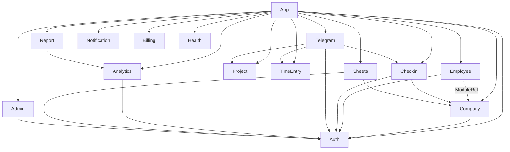

# Backend Modules

NestJS feature modules in `src/modules/`. This file explains each module's responsibility and integration points.

## Module Dependency Graph

## Auth

**Path**: `src/modules/auth/`

**Purpose**: Handles Telegram WebApp initData verification, Telegram-bot-issued one-time codes, JWT access/refresh token pair issuing, and the `/auth/me` endpoint. Owns the crypto boundary where an external Telegram identity is converted into an internal `User` row plus a pair of bearer tokens.

**Key files**:
- `auth.module.ts` — registers Passport (`defaultStrategy: 'jwt'`), `JwtModule.registerAsync` bound to `JWT_ACCESS_SECRET`, exports `AuthService`.
- `auth.service.ts` — HMAC-SHA256 validation of Telegram `initData` (`WebAppData` key ladder), OTC issue/consume (6-digit codes, 120s TTL, in-memory map + best-effort Redis mirror), user upsert by `telegramId`, `issueTokens` (15m access + 7d refresh), `refresh` with `typ: 'refresh'` guard.
- `auth.controller.ts` — `POST /auth/telegram/verify`, `POST /auth/telegram/bot-login`, `POST /auth/refresh` (all `@Public()`), `GET /auth/me` guarded by Passport JWT. Declares the `@Public()` decorator metadata key consumed by `JwtAuthGuard`.
- `strategies/jwt.strategy.ts` — PassportStrategy extracting `Bearer` from `Authorization`, validating against `JWT_ACCESS_SECRET`, returning `{ id, telegramId }`.
- `dto/telegram-verify.dto.ts`, `dto/bot-login.dto.ts`, `dto/refresh.dto.ts` — Zod-derived DTOs.

**Cross-module**: Issues JWTs consumed by every other module's `JwtAuthGuard` / `AuthGuard('jwt')`. Injected by Telegram module so the `/login` bot command can mint OTCs. Consumed by Employee and Checkin controllers via Passport.

**Redis keys**: `otc:<6digit>` (120s TTL) — optional mirror of in-memory OTC map so codes survive restarts and work across horizontally scaled instances.

**External APIs**: None direct; verifies cryptographic signatures from Telegram.

**Notable design choices**: OTC mirror to Redis is fire-and-forget — a slow Redis must never block the bot handler. Refresh token rotation re-issues a brand-new pair (no replay window). `timingSafeEqual` used on all HMAC comparisons.

## Company

**Path**: `src/modules/company/`

**Purpose**: CRUD for `Company` rows (create, findMy, findBySlug, update), employee roster management (list, update, deactivate), and the Telegram deep-link invite flow. On `create`, the caller is transactionally attached as `OWNER`.

**Key files**:
- `company.module.ts` — declares `CompanyController`, `CompanyService`, `InviteTokenService`, `CompanyRoleGuard`; exports the service + invite service (consumed by Employee and Telegram modules).
- `company.service.ts` — slug generation with NFKD-strip + retry on P2002, `create` inside `$transaction` so the `OWNER` employee is atomic with the company, role-gated mutations (`update`, `inviteEmployee`, `updateEmployee`, `deactivateEmployee`). Guards against demoting/deactivating the last `OWNER` via `ConflictException`.
- `company.controller.ts` — `POST /companies`, `GET /companies/my`, `GET /companies/:slug`, `PATCH /companies/:id`, `POST /companies/:id/employees/invite` (throttled via `RATE_LIMITS.TELEGRAM_INVITE`), `GET /companies/:id/employees`, `PATCH/DELETE` on individual employees. Uses `@RequireRole` + `CompanyRoleGuard` for role gating.
- `invite-token.service.ts` — nanoid(16) tokens persisted in `InviteToken` table with 7-day TTL; atomic `consume` via `updateMany` with guard conditions so concurrent callers race safely; hourly `@Cron('0 * * * *')` cleanup removes expired unused tokens and consumed tokens older than 30d.
- `guards/company-role.guard.ts` — reads `@RequireRole` metadata, looks up the caller's Employee row for `:id` (or `:companyId`) param, allows only matching roles.

**Cross-module**: `InviteTokenService` is consumed by `EmployeeController.acceptInvite` (resolved via `ModuleRef` to avoid a module-level cycle) and by Telegram's `StartHandler` for `/start inv_<token>` deep links.

**Redis/DB usage**: Reads/writes `Company`, `Employee`, `InviteToken` tables only. No Redis.

**External APIs**: None directly — generates `https://t.me/<BOT>?start=inv_<token>` URLs.

**Notable design choices**: Slug collision disambiguated by a 6-char cuid suffix up to 5 retries; `@Cron` for invite cleanup keeps the `InviteToken` table bounded without a separate worker.

## Employee

**Path**: `src/modules/employee/`

**Purpose**: Per-employee self-service views — `myEmployees` across companies, `getMyEmployee` for a specific company with computed stats (today's check-in status, current-month worked hours, late count), admin read of another employee, and the `accept-invite` endpoint.

**Key files**:
- `employee.module.ts` — imports `PrismaModule`, provides `EmployeeService`. Does not import `CompanyModule` to avoid a cycle; instead resolves `InviteTokenService` via `ModuleRef`.
- `employee.service.ts` — serializes `Decimal` money fields to string (JSON-safe), computes stats by pairing IN/OUT check-ins and applying a fixed +3h MSK offset (Europe/Moscow) for "isLate" — no tz library for a single supported zone. `createFromInvite` is idempotent-ish: returns existing row rather than throwing.
- `employee.controller.ts` — guards every route with `AuthGuard('jwt')`. `GET /employees/me`, `GET /employees/me/:companyId`, `POST /employees/accept-invite` (consumes `InviteTokenService` via `ModuleRef.get(..., { strict: false })`), `GET /employees/:employeeId` (admin). Route order matters: `me/:companyId` before `/:employeeId`.

**Cross-module**: Depends on `InviteTokenService` from `CompanyModule`. Invoked by Telegram's `StatsHandler` and `StartHandler` indirectly (Telegram handlers read Prisma directly, but the service is exported for future consumers).

**Redis/DB usage**: `Employee`, `CheckIn`, `User`, `Company` tables.

**External APIs**: None.

**Notable design choices**: `ModuleRef` with `strict: false` is an explicit workaround for file-level-but-not-module-level dependency on `InviteTokenService`; keeps `EmployeeModule` testable in isolation.

## Checkin

**Path**: `src/modules/checkin/`

**Purpose**: Rotating office QR display feed (30s rotation, 45s TTL, 5s overlap), employee scan submission with geofence enforcement, SSE live feed for display screens, monthly history, and OWNER/MANAGER manual check-in creation.

**Key files**:
- `checkin.module.ts` — registers a local `JwtModule` with `JWT_ACCESS_SECRET` so the controller can decode bearer tokens on `@Public` SSE routes without going through Passport. Exports `CheckinService` and `QrService`.
- `checkin.service.ts` — `scan` flow (verify signature → employee lookup → verify-for-employee single-use → decide IN/OUT via `nextTypeFor` → Haversine geofence with 50m buffer on top of `Company.geofenceRadiusM` → persist `CheckIn` → mark token consumed), `listMyMonth`, `manualCreate` (role-gated OWNER/MANAGER within the target employee's company).
- `qr.service.ts` — HMAC-SHA256 signed tokens (`base64url(JSON) + "." + base64url(sig)`), DB row as source of truth for expiry, single-use-per-employee tracked via `QRToken.usedByEmployeeId`. `@Cron('*/30 * * * * *')` rotates tokens for "active" companies only (filtered via `checkIns.some` today) so idle offices don't burn DB writes.
- `checkin.controller.ts` — `POST /checkin/scan` (JWT, throttled), `GET /checkin/qr/:companyId/current` (dual auth: `X-Display-Key` header or employee JWT), `GET /checkin/qr/:companyId/stream` (SSE, same dual auth, 10s heartbeat), `GET /checkin/history`, `POST /checkin/manual`.
- `sse.helper.ts` — `SseHub` wrapping per-company `ReplaySubject(1)` so new subscribers get the current token immediately.
- `qr.service.spec.ts`, `__tests__/` — unit tests for signing, rotation index, employee single-use enforcement.

**Cross-module**: Consumed by Telegram's `CheckinHandler` for in-bot QR generation. Depends on `Company` for `latitude`, `longitude`, `geofenceRadiusM`, `workStartHour`.

**Redis/DB usage**: `QRToken`, `CheckIn`, `Employee`, `Company` tables. No Redis.

**External APIs**: None. QR rendering happens client-side from the token string.

**Notable design choices**: Display screens authenticate with `X-Display-Key` (per-company constant-time comparison against `DISPLAY_KEYS` JSON env map) — no Telegram login on kiosk devices. `@Public()` + in-controller `JwtService.verify` fallback avoids Passport's all-or-nothing guard.

## Project

**Path**: `src/modules/project/`

**Purpose**: B2C freelancer project CRUD and the headline "real hourly rate" insight (`monthlySummary`) — compares declared vs actual ₽/час to surface underpriced work at month end.

**Key files**:
- `project.module.ts` — `ProjectController` + `ProjectService`; relies on `@Global()` `PrismaModule`.
- `project.service.ts` — ownership enforced by `Project.userId` on every query; list uses single `groupBy` + `findMany` to avoid N+1 on aggregate totals; `delete` is safe-by-default (requires `force=true` or `status === 'ARCHIVED'`, else `ConflictException`); `monthlySummary` builds a Russian-language "insight" string with RUB rate bands (<500 / 500–1500 / 1500–3000 / >3000).
- `project.controller.ts` — `POST /projects`, `GET /projects`, `GET /projects/:id`, `PATCH /projects/:id`, `DELETE /projects/:id?force=true`, `GET /projects/:id/monthly-summary?month=YYYY-MM`. All routes use `@CurrentUser()`; global `JwtAuthGuard` handles auth.
- `__tests__/` + `project.service.spec.ts` — unit coverage for rate band logic, ownership assertions, and force-delete gating.

**Cross-module**: Time aggregation reads `TimeEntry` via Prisma directly (no import dependency on `TimeEntryModule` — both reach into the same schema). Consumed by Telegram's `ProjectHandler`.

**Redis/DB usage**: `Project`, `TimeEntry` tables. No Redis.

**External APIs**: None.

**Notable design choices**: "Income" rule: `hourlyRate * hours` OR (only if `status === 'DONE'`) `fixedPrice`. Insight copy is Russian-first to match the freelancer audience.

## TimeEntry

**Path**: `src/modules/time-entry/`

**Purpose**: Timer sessions for freelancer projects (`start`, `stop`, `active`, `list`, `createManual`, `delete`). Core invariant: a user has AT MOST ONE open entry (`endedAt = null`) across all their projects at any time.

**Key files**:
- `time-entry.module.ts` — `TimeEntryController` + `TimeEntryService`. No explicit imports (Prisma global; ownership verified via `Project.userId` join in-service).
- `time-entry.service.ts` — `start` auto-closes any open entry in a `$transaction` before creating a new one; `closeAllOpenForUser` is defensive against drift; `stop` computes `durationSec` from `endedAt - startedAt`; `list` applies `projectId`/`from`/`to` filter with `take: 500` safety cap; `createManual` rejects `startedAt >= endedAt`.
- `time-entry.controller.ts` — `POST /time-entries/start`, `POST /time-entries/:id/stop`, `GET /time-entries/active`, `GET /time-entries` (with optional filters), `POST /time-entries/manual`, `DELETE /time-entries/:id`. Global JWT guard.
- `dto/start-timer.dto.ts`, `dto/manual-entry.dto.ts` — Zod DTOs.

**Cross-module**: Ownership is verified through `Project.userId` so no `ProjectModule` import is needed. Consumed by Telegram's `ProjectHandler` (which also starts/stops timers from bot commands).

**Redis/DB usage**: `TimeEntry`, `Project` tables.

**External APIs**: None.

**Notable design choices**: Single-open-entry invariant is enforced in service, not a DB unique constraint — drift is possible under race, hence the defensive loop that closes *all* open entries on `start`.

## Telegram

**Path**: `src/modules/telegram/`

**Purpose**: Telegraf-based Telegram bot. Handles `/start` (plain + `inv_<token>` deep links), `/login` (issues an OTC via `AuthService`), `/checkin` (shows QR or calls `QrService`), project management commands, and monthly stats.

**Key files**:
- `telegram.module.ts` — `TelegrafModule.forRootAsync` with `TELEGRAM_BOT_TOKEN` and a chained `UserMiddleware`. Imports Auth, Company, Checkin, Project, TimeEntry modules so handlers can call their services directly. Exports `BotService`.
- `bot.service.ts` — thin wrapper around `Telegraf.telegram.sendMessage` for server-initiated notifications (`notifyUser(telegramId, text, opts)`); swallows errors and returns boolean success.
- `handlers/start.handler.ts` — handles `/start`, including invite deep-link consumption via `InviteTokenService`.
- `handlers/auth.handler.ts` — `/login` issues `AuthService.issueBotOneTimeCode`, returns a code + web-app button.
- `handlers/checkin.handler.ts` — employee-side check-in helpers.
- `handlers/project.handler.ts` — CRUD on `Project` via `ProjectService` + timer commands via `TimeEntryService`.
- `handlers/stats.handler.ts` — monthly personal stats.
- `handlers/errors.filter.ts` — Telegraf global error filter, prevents an exception from crashing the bot.
- `middleware/user.middleware.ts` — extracts `ctx.from`, upserts `User` via Prisma, attaches `ctx.state.user` and `ctx.state.employee` lookup helpers.
- `session.ts` + `registerSessionRedis(redis)` — Telegraf session storage backed by Redis when available, falling back to memory.

**Cross-module**: Deepest consumer — imports Auth (OTC issuing), Company (invite consume), Checkin (QR), Project + TimeEntry. Broadcasts via `BotService` used by other modules for async notifications.

**Redis/DB usage**: Telegraf session store in Redis (key prefix `tg:session:<chatId>`). All command handlers touch Prisma directly via the imported services.

**External APIs**: Telegram Bot API (via Telegraf). Long-polling by default; webhook mode is a drop-in via `TELEGRAM_WEBHOOK_URL` in prod.

**Notable design choices**: `UserMiddleware` runs on every update and ensures the `User` row exists, so downstream handlers never `findUnique` for missing users. Session store is pluggable — Redis when present (so horizontal scaling shares session state), in-memory otherwise.

## Analytics

**Path**: `src/modules/analytics/`

**Purpose**: Aggregations over `CheckIn` and `TimeEntry` data. Serves B2B dashboards (late stats, ranking by punctuality, overtime, summary) and the B2C dashboard (real hourly rate, per-project rate history).

**Key files**:
- `analytics.module.ts` — explicit `PrismaModule` import (for isolated-test friendliness), provides `AnalyticsService` + `CompanyAdminGuard`, exports `AnalyticsService` for `ReportModule`.
- `analytics.service.ts` — per-day grouping via helper; RUB-only heuristic for "effective rate"; `$queryRaw` used for a one-shot `SUM(durationSec) GROUP BY projectId` to skip shipping every `TimeEntry` over the wire. `getProjectRateHistory` amortises fixed-price income across months that contain work when `status === 'DONE'`.
- `analytics.helpers.ts` — pure functions: `buildMonthRange`, `computeLateMinutes`, `computeOvertime`, `groupByDay`, `groupByEmployee`, `localParts` (Intl-based), `punctualityScore`, `lastNMonths`, `isWeekend`, `LATE_GRACE_MINUTES` constant.
- `analytics.controller.ts` — `GET /analytics/company/:companyId/{late-stats,ranking,overtime,summary}` (OWNER/MANAGER via `CompanyAdminGuard`), `GET /analytics/user/real-hourly-rate`, `GET /analytics/user/project/:projectId/rate-history`.
- `guards/company-admin.guard.ts` — route-local guard that resolves the caller's `Employee.role` within `:companyId` param and allows `OWNER` or `MANAGER` only.
- `__tests__/` + `analytics.helpers.spec.ts` — coverage for date/timezone helpers and `punctualityScore` thresholds.

**Cross-module**: Exported `AnalyticsService` and `CompanyAdminGuard` are consumed by `ReportModule` so invoice/attendance PDFs share the exact same aggregate logic as the dashboard.

**Redis/DB usage**: Read-only against `Employee`, `CheckIn`, `Project`, `TimeEntry`, `Company`. No Redis.

**External APIs**: None.

**Notable design choices**: Pure helpers in `analytics.helpers.ts` + mixed typed-Prisma/raw-SQL approach — typed for clarity, `$queryRaw` only where `GROUP BY date_trunc` or large aggregates justify it.

## Sheets

**Path**: `src/modules/sheets/`

**Purpose**: One-click Google Sheets export of a company's monthly attendance + summary. NOT the source of truth — purely a convenience for managers who prefer spreadsheets.

**Key files**:
- `sheets.module.ts` — imports `PrismaModule`, `ConfigModule`; provides `SheetsController` + `SheetsService`; exports the service so other modules (e.g. a scheduled worker) can trigger exports.
- `sheets.service.ts` — lazy `GoogleAuth` client from `GOOGLE_SERVICE_ACCOUNT_JSON` file (throws `NotImplementedException` with a friendly message when missing); `getOrCreateSpreadsheet` creates `"Work Tact — <companyName>"` with two tabs ("Attendance", "Summary"), optionally grants writer permission to a list of emails via Drive API; `exportCompanyMonth` reads check-ins for the month, builds `AttendanceRow[]` + `SummaryRow[]`, clears and rewrites both sheets, freezes header row. `finalPayout` heuristic subtracts a lateness penalty from `monthlySalary`.
- `sheets.controller.ts` — `POST /sheets/export/company/:companyId/monthly` (throttled via `RATE_LIMITS.SHEETS_EXPORT`) and `GET /sheets/company/:companyId/link`. Auth via Passport JWT; role gating is inlined in the controller to avoid a circular import with `CompanyModule`.
- `storage/company-sheet-store.ts` — tiny JSON-file store (`data/sheets/company-sheets.json`) mapping `companyId → { spreadsheetId, url, createdAt }`. Persists across restarts without a new DB table.
- `sheets.types.ts` — `AttendanceRow`, `SummaryRow`, `ExportResult`, `StoredCompanySheet`.

**Cross-module**: Reads `Company`, `Employee`, `CheckIn`. Complements `ReportModule` (PDF) with a live-editable spreadsheet.

**Redis/DB usage**: Prisma reads only; filesystem for the `company-sheet-store.json` persistence.

**External APIs**: Google Sheets v4 (`spreadsheets.create`, `spreadsheets.values.update`, `batchUpdate` for freezing), Google Drive v3 (`permissions.create` for granting writer access).

**Notable design choices**: JSON file store was chosen over a schema migration because the spreadsheet ID is operational config, not domain data. Graceful degradation: if the service-account JSON is absent, `getAuthClient` throws `501 NotImplemented` so clients see a clean "not configured" error.

## Report

**Path**: `src/modules/report/`

**Purpose**: PDF generation — B2B monthly attendance reports and B2C freelance invoices. Both render as streaming `Readable`s so memory stays flat.

**Key files**:
- `report.module.ts` — imports `PrismaModule` + `AnalyticsModule` (for `AnalyticsService.getUserRealHourlyRate` — invoice totals match dashboard exactly). Registers `CompanyAdminGuard` as a provider so the controller can `@UseGuards` it.
- `report.service.ts` — `buildAttendancePdf(companyId, month)` and `buildInvoicePdf(userId, month, projectId?)` return `Readable`. Reuses `analytics.helpers` for `LATE_GRACE_MINUTES`, `computeLateMinutes`, `computeOvertime`, `groupByDay`, `localParts`, `isWeekend` so numbers line up with the dashboard. Uses `PDFKit` with `bufferPages: true` to paint footers with "page N of M"; custom fonts + layout primitives in `pdf/` subdir.
- `report.controller.ts` — `GET /reports/company/:companyId/attendance.pdf?month=YYYY-MM` (OWNER/MANAGER via `CompanyAdminGuard`), `GET /reports/user/invoice.pdf?month=YYYY-MM&projectId=...` (always the caller's own data). Sets `Content-Type: application/pdf`, `Content-Disposition: attachment`, `Cache-Control: private, no-store`.
- `pdf/layout.ts`, `pdf/fonts.ts` — shared colour palette (cream / stone / coral / muted), spacing scale, hairline primitive, `registerFonts` + `useFont` helpers.

**Cross-module**: Depends on `AnalyticsModule` for `AnalyticsService` (income breakdown) and borrows `CompanyAdminGuard` from it.

**Redis/DB usage**: Prisma reads only.

**External APIs**: None — PDFs rendered server-side with PDFKit, streamed directly to `res`.

**Notable design choices**: Streaming (`Readable`) rather than buffered output keeps large-roster reports from blowing the heap. Invoice number is deterministic (`INV-<YYYYMM>-<last6>`), so reruns collide intentionally.

## Notification

**Path**: `src/modules/notification/`

**Purpose**: Transactional email delivery (employee invite, monthly report ready, magic auth link). Intentionally forgiving: SMTP-missing is a no-op that logs at info; runtime failure is a no-op that logs at warn. Email is a side channel, never a source of truth.

**Key files**:
- `notification.module.ts` — trivial module exporting `NotificationService` (no controllers — pure consumer-facing library).
- `notification.service.ts` — lazy `nodemailer` transporter (dynamic `import()` so missing module during local dev doesn't crash boot). `send()` no-ops gracefully when `SMTP_HOST`/`MAIL_FROM` are missing. `sendEmployeeInvite`, `sendMonthlyReportReady`, `sendAuthLink` each render via a template module and dispatch.
- `templates/employee-invite.template.ts`, `templates/monthly-report-ready.template.ts`, `templates/auth-link.template.ts` — each returns `{ subject, html, text }`. `templates/shared.ts` holds common HTML scaffolding (brand header, footer, safe-HTML escape).
- `dto/` — typed DTOs for `sendEmployeeInvite`, `sendMonthlyReportReady`, `sendAuthLink`.

**Cross-module**: Consumed by `CompanyService` (invite email alongside Telegram link), `SheetsService` (monthly-report-ready), potentially `AuthModule` (magic link fallback).

**Redis/DB usage**: None.

**External APIs**: SMTP (provider-agnostic; secure-on-465, STARTTLS-otherwise).

**Notable design choices**: `@InjectPinoLogger(NotificationService.name)` rather than raw `Logger` so failed sends show up in structured logs with `kind/to/subject/err` fields for alerting.

## Admin

**Path**: `src/modules/admin/`

**Purpose**: Platform super-admin console (cross-company visibility). Global counters, company search + details, user lookup, soft-deactivate a company.

**Key files**:
- `admin.module.ts` — imports `PrismaModule` (belt-and-braces despite `@Global()`). Exports nothing — admin surface is not consumed by other modules.
- `admin.service.ts` — `stats` parallelises six counts; `listCompanies` is cursor-paginated (`take: limit+1` trick for `hasMore`) with optional name/slug search (`mode: 'insensitive'`); `companyDetails` bundles owner + up-to-100 employees with BigInt → string serialization; `deactivateCompany` is a soft-close that flips every active employee to `INACTIVE` (no `status` column on Company, by design).
- `admin.controller.ts` — `GET /admin/stats`, `GET /admin/companies`, `GET /admin/companies/:id`, `POST /admin/companies/:id/deactivate`, `GET /admin/users`. All routes `@UseGuards(JwtAuthGuard, SuperAdminGuard)`.
- `guards/super-admin.guard.ts` — reads `SUPER_ADMIN_TELEGRAM_IDS` (comma-separated list) from config and asserts the caller's `telegramId` is in it.

**Cross-module**: Consumes only Prisma — cross-module isolation is deliberate so a compromised admin controller can't escalate via service methods that assume scoping.

**Redis/DB usage**: Prisma reads across all tables; no Redis.

**External APIs**: None.

**Notable design choices**: No `Company.status` column — soft-deactivation works at the `Employee` level. Cursor pagination over offset to keep it stable under inserts.

## Billing

**Path**: `src/modules/billing/`

**Purpose**: Tracks the `Subscription` row per company and exposes the tier feature matrix. Payment provider integration (Stripe / YooKassa) is deliberately stubbed — the controller returns fake session URLs and the webhook is a landing pad.

**Key files**:
- `billing.module.ts` — exports `BillingService` + `SeatLimitGuard` so other modules (future `CompanyController.invite`) can gate invites by seat count.
- `billing.service.ts` — `getSubscription`, `getEffectiveLimits(tier)`, `checkSeatAvailable(companyId)` (throws `ForbiddenException` at/over cap, Russian error copy), `createDefaultFreeSubscription` (TODO: wire into `CompanyService.create`).
- `billing.controller.ts` — `GET /billing/my/:companyId` (owner-only), `POST /billing/checkout` (stub — returns `/billing/stub?session=...`), `POST /billing/webhook` (`@Public()` — accepts any payload with 200 so providers don't retry during development).
- `tier-config.ts` — `TIERS: Record<SubscriptionTier, TierFeatures>` with `FREE` (5 seats, no Sheets), `TEAM` (100 seats, 200 ₽/seat/mo, Sheets), `ENTERPRISE` (10 000 seats, custom branding, null price = contact sales).
- `guards/seat-limit.guard.ts` — guards employee-invite routes by delegating to `checkSeatAvailable`.
- `README.md` — integration notes for when YooKassa is wired in.

**Cross-module**: `SeatLimitGuard` is intended to wrap `CompanyController.invite`; `BillingService.createDefaultFreeSubscription` should be called from `CompanyService.create` post-commit.

**Redis/DB usage**: `Subscription`, `Employee` (count check).

**External APIs**: Stubbed. Target: YooKassa payments + webhooks; Stripe path sketched in comments.

**Notable design choices**: Missing `Subscription` row falls back to `TIERS.FREE` defaults rather than blocking — new companies may race the subscription provisioning step.

## Health

**Path**: `src/modules/health/`

**Purpose**: Liveness + readiness probes for container orchestration (Docker/k8s) plus a human-readable `/health`.

**Key files**:
- `health.module.ts` — imports `TerminusModule`, `HttpModule`, `PrismaModule`; provides two custom indicators.
- `health.controller.ts` — `GET /health` (basic info: version, uptime, timestamp — `@Public()`), `GET /healthz/live` (liveness — returns immediately), `GET /healthz/ready` (readiness — runs Prisma `SELECT 1` with 1.5s timeout; Redis ping with 1s timeout when `RedisService` is configured).
- `indicators/prisma.indicator.ts` — Terminus `HealthIndicator` running `$queryRaw` against Prisma.
- `indicators/redis.indicator.ts` — optional Redis ping; exposes `isConfigured` so the readiness endpoint skips it in dev.

**Cross-module**: None — health lives independent of all feature modules.

**Redis/DB usage**: Both, as liveness signals.

**External APIs**: None.

**Notable design choices**: `/healthz/live` never touches downstream deps (orchestrator restart loop safety); `/healthz/ready` does (traffic cutoff on DB/Redis unavailability). Version read from `APP_VERSION` env with fallbacks.

## Common / Cross-cutting

### `common/prisma` — global PrismaService

`PrismaService extends PrismaClient` with `$connect` on module init and `$disconnect` on shutdown. Registered `@Global()` in `AppModule` so all feature modules inject it without an explicit import.

### `common/redis` — Redis client with in-memory fallback

`RedisService` exposing `get/set/del/incr/expire` with a uniform Promise interface. Gracefully falls back to an in-memory Map when `REDIS_URL` is absent so local dev doesn't require a running Redis. Optional-injected into Auth (OTC mirror), Telegram (Telegraf session), throttler.

### `common/logger` — nestjs-pino global logger

Structured JSON logs, `traceId` populated from `cls-hooked` on every request. `PinoLogger` injected via `@InjectPinoLogger(<name>)` in services that want structured fields.

### `common/guards/jwt-auth.guard.ts` — global gate honouring `@Public()`

Extends `AuthGuard('jwt')` and checks the `@Public()` metadata key (from Auth module) via `Reflector`. Registered globally in `AppModule` so every route is authenticated by default unless it opts out.

### `common/decorators/current-user.decorator.ts`

Parameter decorator returning `req.user` — the `{ id, telegramId }` payload produced by `JwtStrategy.validate`.

### `common/filters/http-exception.filter.ts` + `sentry.filter.ts`

Global `HttpExceptionFilter` converts Nest exceptions to a stable `{ statusCode, message, error }` envelope. `SentryFilter` (when `SENTRY_DSN` set) forwards 5xx + uncaught exceptions to Sentry before delegating to the HTTP filter.

### `common/interceptors/logging.interceptor.ts`

Per-request interceptor logging `method url status durationMs` at info. Skips `/healthz/*` to keep probe noise out of logs.

### `common/throttle/` — per-route rate-limit policies

`RATE_LIMITS` constants (`AUTH.botLogin`, `CHECKIN_SCAN`, `SHEETS_EXPORT`, `TELEGRAM_INVITE`) consumed via `@Throttle()` decorators on the hot routes. Redis-backed storage when available so limits are shared across instances.

### `common/security/` — helmet config, sanitization helpers

`helmet()` middleware with a tuned CSP; `sanitizeHtml` helper used by notification templates.

## Module Authoring Checklist

When adding a new module:

1. `nest g module <name>`, `nest g service <name>`, `nest g controller <name>`.
2. Import `PrismaModule` (implicit via `@Global()` — or explicit for isolated-test friendliness).
3. Add DTOs as `createZodDto()` instances sourced from `@worktime/types`.
4. Wrap controller routes with `JwtAuthGuard` (applied globally in `AppModule`); mark public routes with `@Public()` from `common/decorators/public.decorator.ts`.
5. Use `PinoLogger` via `@InjectPinoLogger(<ServiceName>.name)` rather than Nest's raw `Logger`.
6. Tag controller routes with `@ApiTags`, `@ApiOperation`, `@ApiResponse`, `@ApiBearerAuth('jwt')`.
7. Add unit spec at `<name>.service.spec.ts`; keep integration tests in `test/`.
8. Register the module in `src/app.module.ts`.
9. Document the module in this file — one section per module with Path, Purpose, Key files, Cross-module integration, Redis/DB usage, External APIs, Notable design choices.
