# Rotating QR Anti-Fraud System

Deep dive on how Work Tact prevents employees from checking in without physically
being at the office. Reflects behaviour of
`backend/src/modules/checkin/qr.service.ts`,
`backend/src/modules/checkin/checkin.service.ts`, and
`backend/src/modules/checkin/sse.helper.ts` as of this revision.

---

## Problem

Static QR codes get photographed and shared via group chats. Employees "check
in" from home without going to the office. That single failure mode is enough
to destroy the product's core promise — trustworthy attendance data — because
nothing in the payload changes from one scan to the next.

A workable solution has to hit four constraints simultaneously:

1. **Prevent photo-and-send attack** — a still image of the QR must stop
   working quickly, ideally before it can be forwarded and re-used.
2. **Prevent one employee checking in many others** — even in person, a single
   cooperative employee must not be able to walk a phone around and scan on
   behalf of absent colleagues.
3. **Optional: verify physical presence via GPS** — when the office has been
   configured with a geofence, a scan from outside it must fail.
4. **Keep frictionless UX (single scan with Telegram)** — the employee
   experience is literally "point the camera, tap the link, done". We are not
   willing to sacrifice that for any of the above.

Anything that requires dedicated hardware (NFC readers, BLE beacons), app
installs, or biometric capture is out. The office display is just a web page
showing a QR; the employee's client is the Telegram app they already have.

---

## Solution

Three-layer defense, each cheap on its own and compounding when combined.

1. **Rotating tokens.** The QR on screen regenerates every 30 seconds. Each
   token is valid for 45 seconds, giving a 5-second overlap so a scan captured
   in the final moments of a token still completes after the display has moved
   on to the next one. A photograph older than ~45s is dead.
2. **Telegram identity binding.** Scanning the QR opens
   `t.me/<bot>?start=qr_<token>`. The `/start` handler reads the authenticated
   Telegram user's id and looks up the employee record via that id. A
   forwarded screenshot is worthless to anyone else — their Telegram account
   is not the employee's, so `scan()` rejects with 403 before any side-effect
   runs.
3. **Optional geofence.** When the company has `latitude`, `longitude`, and
   `geofenceRadiusM` configured, and the scan request carries GPS
   coordinates, the service computes Haversine distance and rejects scans
   further than `geofenceRadiusM + 50m` from the office. The 50m buffer
   (`GEOFENCE_BUFFER_M` in `checkin.service.ts`) forgives the usual urban-
   canyon GPS jitter without forcing admins to oversize their configured
   radius.

None of the three is bulletproof alone. Rotation alone doesn't stop a single
malicious employee from scanning for everyone in person. Telegram-binding
alone doesn't stop a shared account (rare but possible). Geofence alone can be
defeated by a rooted device. Combined, the realistic attack surface shrinks
to "a determined employee, on the office premises, who is willing to hand
their unlocked Telegram to a colleague" — at which point the organisation has
a people problem, not a technology problem.

---

## Token Format

```
<base64url(payload)>.<base64url(hmac)>
payload = { c: companyId, r: rotationIndex, n: nanoid(8) }
hmac    = HMAC_SHA256(QR_HMAC_SECRET, base64url(payload))
```

Where:

- `c` is the target company id — leaks when the QR is scanned, but company
  membership is already derivable from any employee's public profile, so this
  is not a meaningful disclosure.
- `r` is `floor(Date.now() / 30_000)`, the same rotation bucket index used
  everywhere else in the service. Having it in the payload lets observability
  tooling reason about which rotation a given scan belongs to without a DB
  lookup.
- `n` is an 8-character `nanoid`, making each token unique even if two
  companies happen to rotate in the same millisecond.

The payload is deliberately **not** secret. The HMAC is what stops forgery:
without `QR_HMAC_SECRET`, a client cannot construct a string that
`QrService.decodeToken` will accept. The signature comparison uses
`crypto.timingSafeEqual` on equal-length buffers, with a length guard up
front because `timingSafeEqual` throws on mismatched lengths. See
`qr.service.ts` lines 96–132.

The DB row for the token is still the source of truth for **expiry** and
**single-use-per-employee** enforcement. A valid-signature-but-no-row scenario
(e.g. token from a previous boot before a DB wipe) is treated as forgery and
rejected with `Unknown QR token`.

---

## Timing Diagram

```mermaid
gantt
  dateFormat  s
  axisFormat %S
  section Token A
  Generated :done, a1, 0, 30s
  TTL remaining :active, a2, 30, 15s
  section Token B
  Pre-mint + become "current" :b1, 30, 30s
  TTL remaining :b2, 60, 15s
  section Scan window
  A valid (T+0..45) :s1, 0, 45s
  Rotation overlap (T+30..45) :s2, 30, 15s
```



At `T+30`, Token B is minted and immediately becomes the "current" token
served by `/qr/:companyId/current` (via `currentForCompany`, which returns
the newest row whose `expiresAt > now`). Token A is still valid until `T+45`
for anyone who scanned the camera just before the screen changed. The 5-second
overlap is the sole reason `TTL_SEC = 45` while `ROTATION_SEC = 30`.

---

## Rotation Cron

`@Cron('*/30 * * * * *')` on `QrService.rotateAll()`:

- Queries `prisma.company.findMany` for every company that has at least one
  `ACTIVE` employee with any `CheckIn.timestamp >= startOfDay(today)` — a
  cheap proxy for "this office is actually in use right now". Dormant
  companies don't waste a row on every tick.
- For each match, calls `generateForCompany(companyId)`, which:
  1. Builds a fresh `TokenPayload`, HMAC-signs it, stores a `QRToken` row
     with `expiresAt = now + 45s`, and
  2. Publishes the `QRTokenDisplay` to the per-company `ReplaySubject` in
     `SseHub`, which fans it out to any subscribed office display.
- Errors inside a single company's generation are caught and logged so one
  bad row doesn't abort the rest of the batch. A fatal error at the outer
  level is also caught; the cron will simply try again in 30 seconds.

---

## Data Model

`QRToken` row:

| column | purpose |
|--------|---------|
| `id` | primary key, referenced from `CheckIn.tokenId` |
| `token` | the full signed string as served to the display |
| `companyId` | FK to the owning company |
| `expiresAt` | absolute wall-clock expiry (`now + TTL_SEC * 1000`) |
| `usedByEmployeeId` | first employee to successfully scan, nullable |
| `usedAt` | timestamp of that first scan |
| `createdAt` | set by Prisma default |

`consume()` runs `UPDATE QRToken SET usedByEmployeeId=?, usedAt=? WHERE token=? AND usedByEmployeeId IS NULL`,
which is first-writer-wins at the SQL level.

Importantly, additional employees **can** scan the same token within its TTL.
`verify()` only blocks the case where the same employee scanned this token
already (i.e. `row.usedByEmployeeId === employeeId`); a different employee
sails through, and the `CheckIn` they create carries `tokenId` pointing back
to the same QR row. The reasoning: during the rotation overlap, several
people can legitimately scan the same on-screen QR within a handful of
seconds. Rejecting all but one would be user-hostile for a threat this
layer isn't trying to stop (multi-scan is already prevented per-employee).

---

## SSE Stream

`GET /api/checkin/qr/:companyId/stream` is the live feed used by the office
display. `SseHub` is a thin wrapper around an RxJS `ReplaySubject<QRTokenDisplay>(1)`
per company:

- **Buffer size 1** means a newly connecting display immediately receives
  the most recent token on connect, avoiding a blank screen until the next
  rotation. This matters after a display restart or Wi-Fi blip.
- Subjects are created lazily on first `getOrCreate(companyId)` and never
  torn down — the set of active companies is bounded, and keeping subjects
  warm makes reconnects free.
- The HTTP layer is expected to emit a heartbeat every ~10 seconds to keep
  intermediaries from killing the connection. Office terminals reconnect on
  disconnect; a fallback path polls `/qr/:companyId/current` every 15
  seconds if SSE cannot be established (corporate proxies, mostly).

`QrService.generateForCompany` calls `this.sse.publish(companyId, display)`
as the final step of minting — both manual calls via `currentForCompany`
and the scheduled `rotateAll` funnel through the same publish.

---

## Display Authentication

The office terminal is a shared device that cannot reasonably perform a
Telegram login. Two accepted auth schemes:

- **`X-Display-Key` header** matching a per-company entry in `DISPLAY_KEYS`
  (a JSON map like `{ "company-uuid": "rotated-secret" }` in env). These are
  cheap to rotate and distinct from employee credentials.
- **Bearer JWT** belonging to any active employee of the target company.
  Handy for kiosk setups where an admin manually signs the device in once.

Dev default: `?key=test` via query string when running locally, behind a
`NODE_ENV !== 'production'` guard, so the terminal can boot without any
secret plumbing.

---

## Failure Modes

| Scenario | Outcome |
|----------|---------|
| Token tampered (bad HMAC) | 401 `Invalid QR token signature` + `log.warn` |
| Token malformed (no dot / bad base64) | 400 `Malformed QR token` / `Unreadable QR token payload` |
| Token row not in DB | 401 `Unknown QR token` |
| Payload companyId != DB row companyId | 401 `QR token mismatch` (forgery) |
| Token expired | 401 `QR token expired` + `log.info` (normal) |
| Token already consumed by same employee | 403 `This QR has already been used for your check-in; wait for the next rotation` + `log.warn` |
| Employee not in company | 403 `You are not an employee of this company` + `log.warn` |
| Employee status != ACTIVE | 403 `Your employment is not active` |
| GPS outside geofence | 403 `Вне офисной зоны` (`You are outside the office geofence...`) |
| GPS missing but geofence required | 403 `Нужна геолокация` |
| Company row vanished between verify and geofence check | 404 `Company not found` (should be impossible) |

The expired-token 401 is deliberately logged at `info`, not `warn`: it is the
single most common error and reflects ordinary user behaviour (scanning a
few seconds too late). Signature failures stay at `warn` because they're
suspicious.

---

## Attack Scenarios & Mitigation

1. **Photo + send to friend.** The friend clicks the link, lands in their
   own Telegram. The bot extracts their `telegramId`, looks up an Employee
   record by that id + the token's `companyId`, and finds nothing (or finds
   a different company). `scan()` returns 403. The QR itself is also stale
   within 45 seconds, closing the window further.

2. **Employee A scans for employee B via shared terminal.** The Telegram
   account in play is A's, not B's. `nextTypeFor(A)` advances A's check-in
   state; B's record is untouched. There is no "scan for user X" parameter
   on the endpoint.

3. **Spoofed GPS.** Harder. Defense in depth: rotation frequency + company
   geofence + periodic manager review of mismatched device/location
   patterns. Root-level GPS spoofing on a compromised device is explicitly
   out of scope — Telegram auth + rotation already solve the main attack,
   and deeper defense requires device attestation we do not currently have.

4. **Replay within the 45-second window.** `verify()` with `employeeId`
   blocks the same employee reusing the same token; different employees
   can share one token within 45s, which is accepted behaviour (they both
   legitimately scanned the screen).

5. **Clock skew.** The server is authoritative for both issuance and
   expiry. `rotationIndex = floor(Date.now() / 30_000)` is computed
   server-side at mint time and stored in the payload purely for
   observability. Client clocks do not participate in the decision.

6. **Signature-valid token, unknown row.** `verify()` also looks up the
   token string in the DB, so a token minted against an old secret or
   from a different environment fails at `findUnique` rather than at the
   HMAC check.

7. **Token substitution between companies.** The `row.companyId !== payload.c`
   check in `verify()` catches the case where an attacker grafts a signed
   payload from company A onto a row belonging to company B (e.g. via a
   stale cached token).

---

## Operational Considerations

- **`QR_HMAC_SECRET` rotation.** Target behaviour: rolling rotation where
  both the old and new secret are accepted during a 90-second transition
  window. TODO: implement key-ring in `QrService.sign` / `decodeToken`
  using a list of secrets instead of a single string. Today a rotation
  invalidates all in-flight tokens, causing at most 45s of scan failures.
- **Archival.** `QRToken` rows are cheap but unbounded over time. A
  housekeeping cron to delete rows older than 30 days is a TODO; the table
  currently grows monotonically.
- **Monitoring.** Alert if `rotateAll` misses two consecutive intervals
  (60 seconds of no new rows for companies we know are active). A healthy
  production backend should see one row per active company every 30s; a
  gap indicates either a dead scheduler or a DB outage.
- **Secret length.** `onModuleInit` throws if `QR_HMAC_SECRET` is missing
  or shorter than 16 chars. Production secrets should be 32+ random bytes.

---

## Alternatives Considered

- **NFC.** Requires hardware per office and per employee device. Not every
  phone supports it reliably. Rejected on deployability grounds.
- **BLE proximity.** Battery drain on the office beacon, pairing UX is
  confusing for non-technical staff, and the iOS background-BLE story is
  hostile. Rejected.
- **Biometric.** Adds PII collection risk, legal overhead, and hardware
  cost. Disproportionate for an attendance-tracking product.
- **Static QR + IP geofence.** Trivially bypassed with a VPN, a phone
  hotspot, or just a photo. Rejected.
- **Static QR + GPS only.** GPS spoofing is a well-known single-layer
  defeat; rotation adds negligible cost and dramatically raises the bar.

---

## References

- ADR 0002: `docs/adr/0002-rotating-qr-anti-fraud.md`
- Code: `backend/src/modules/checkin/qr.service.ts`
- Code: `backend/src/modules/checkin/checkin.service.ts`
- Code: `backend/src/modules/checkin/sse.helper.ts`
