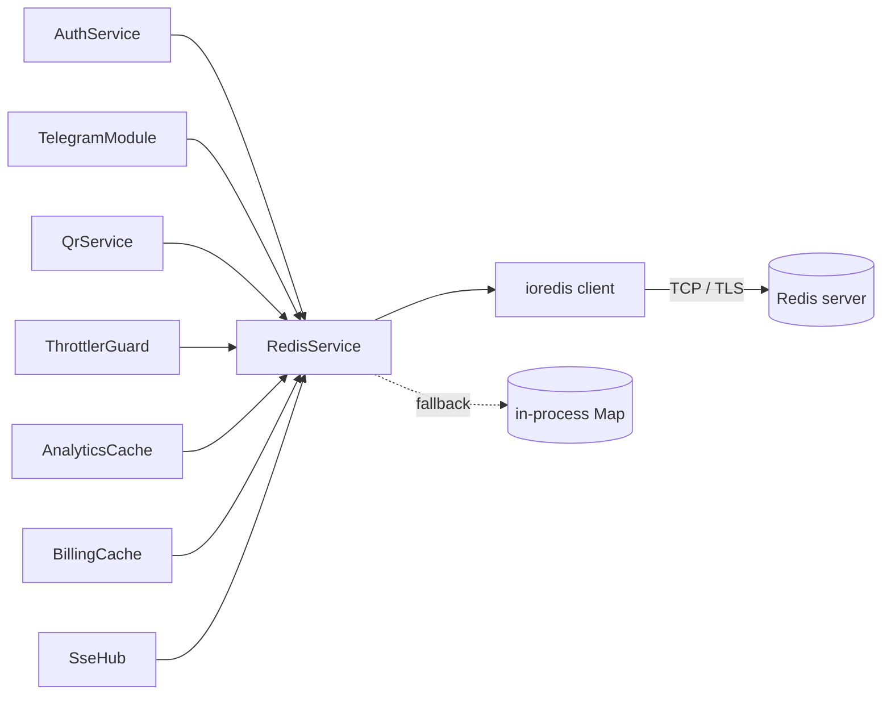

# Redis in Work Tact

This document is the operator-facing reference for how the Work Tact
backend uses Redis: what it's for, what the key schema looks like, how
to run it, how to inspect it, and where to take it as the product
scales. The implementation-level view lives at
`backend/src/common/redis/README.md`; this file is the "why + ops"
view.

## Why Redis in Work Tact

The backend is stateless by design — every replica can serve any
request. But several concerns genuinely need shared, low-latency,
ephemeral storage:

1. **Authentication handshakes.** Magic-link OTCs and Telegram-link
   OTCs are short-lived, single-use, and need to be visible to any
   replica that sees the redemption request.
2. **Telegram bot sessions.** Conversation state (awaiting photo,
   awaiting confirmation, ...) that must survive replica rotation so
   users aren't dropped mid-flow.
3. **Rate limiting / throttling.** Per-user and per-IP counters for
   login, magic-link request, and write endpoints. Must be global or
   an attacker just round-robins through replicas.
4. **QR rotation coordination.** When N replicas all decide to rotate
   the QR at the same second, exactly one should actually mint the
   new token. That's a distributed lock.
5. **Cross-replica SSE fan-out.** A QR rotation happening on replica
   A must push to browser tabs connected to replica B. That's
   pub/sub.
6. **Read-through caches.** Company-by-slug, precomputed monthly
   analytics — anything where the authoritative query is expensive
   and the result is short-lived.
7. **Billing aggregates.** Seat count is computed from Postgres but
   read on the hot path; a TTL-bound cache keeps quota checks cheap.

A Postgres-only design would work for (1)–(3) but at the cost of a
write on every handshake; for (4)–(5) it would not work at all
without advisory-lock + LISTEN/NOTIFY gymnastics.

## Architecture



All callers depend on a single `RedisService`. The service owns a
primary ioredis connection for commands and a lazily-created
secondary connection for SUBSCRIBE (ioredis requires the split).
When Redis is unreachable, the same API is served from an in-process
`Map` — callers never branch on connection state except for pub/sub.

## Key schema reference

| Key                                      | TTL                 | Written by        | Read by                     |
| ---------------------------------------- | ------------------- | ----------------- | --------------------------- |
| `auth:otc:<code>`                        | 2–10 min            | AuthService       | AuthService (redeem)        |
| `auth:refresh:bl:<jti>`                  | 7 days              | AuthService       | JwtStrategy                 |
| `tg:session:<telegramId>`                | 1 hour rolling      | TelegramModule    | TelegramModule              |
| `tg:pending-qr:<telegramId>`             | 10 min              | TelegramModule    | TelegramModule, QrService   |
| `qr:current:<companyId>`                 | 30 s (rotation)     | QrService         | QrService, scanner endpoint |
| `qr:rot-lock:<companyId>`                | 10–30 s             | QrService         | QrService                   |
| `rl:u:<userId>:<bucket>`                 | 1–60 min            | ThrottlerGuard    | ThrottlerGuard              |
| `rl:ip:<ip>:<bucket>`                    | 1–60 min            | ThrottlerGuard    | ThrottlerGuard              |
| `cache:company:slug:<slug>`              | 1 min               | CompanyService    | CompanyService              |
| `cache:analytics:company:<id>:<month>`   | 10 min – 1 day      | AnalyticsService  | AnalyticsService            |
| `billing:seats:<companyId>`              | 1 min               | BillingService    | BillingGuard                |

All keys are produced by the builders in
`backend/src/common/redis/keys.ts`. New keys must be added there first;
inline template strings in feature code are reviewed out.

## Connection configuration

| Env var          | Required | Purpose                                   |
| ---------------- | -------- | ----------------------------------------- |
| `REDIS_URL`      | No*      | `redis://host:port` or `rediss://...` for TLS. If unset, service enters in-memory fallback mode. |
| `REDIS_PASSWORD` | No       | Fallback if the URL doesn't embed creds. Usually prefer `redis://:pass@host:port` form. |

\* Required in production. Unset in local dev unless you want to
exercise the real Redis path.

### TLS

Use the `rediss://` (double-s) URL scheme to force TLS. ioredis picks
this up automatically. For managed Redis (Upstash, ElastiCache with
in-transit encryption, Redis Cloud) this is almost always the right
default.

## Persistence

The local dev Redis (`docker/redis/redis.conf`) ships with both:

- **AOF** (`appendonly yes`, `appendfsync everysec`) — durable on
  crash with at most 1 s of data loss. Good for OTCs and rate-limit
  counters where "lose a second" is acceptable but "lose everything
  since last snapshot" is not.
- **RDB** snapshots (`save 900 1 / 300 10 / 60 10000`) — faster restart
  than AOF-only, serves as the backup target.

In production, most managed Redis services handle persistence for you;
the key decision is whether to enable AOF (recommended for this
workload). If you self-host, mirror the dev config.

## Operational runbook

### Inspect keys by namespace

```
redis-cli -u "$REDIS_URL" --scan --pattern "auth:otc:*" | head -50
redis-cli -u "$REDIS_URL" --scan --pattern "qr:*"       | head -50
redis-cli -u "$REDIS_URL" --scan --pattern "rl:*"       | wc -l
```

Prefer `--scan` over `KEYS` — `KEYS` blocks the single-threaded server
and WILL cause latency spikes on a loaded instance.

### Flush safely

`FLUSHDB` is a sledgehammer. Prefer namespaced deletion:

```
redis-cli -u "$REDIS_URL" --scan --pattern "cache:*" | xargs -r redis-cli -u "$REDIS_URL" del
```

Never flush `auth:refresh:bl:*` without understanding that you've just
un-revoked every revoked refresh token.

### Backup

- **Managed** — use the provider's snapshot feature; confirm retention
  policy covers the RPO you need.
- **Self-hosted** — copy `dump.rdb` or the AOF file while the server
  runs (both are crash-consistent). For PITR, ship the AOF off-box.

## Scaling notes

For MVP the deployment is **single-node Redis** with persistence on.
That's enough for tens of thousands of sessions and hundreds of
thousands of rate-limit buckets on a small instance.

Roadmap:

1. **Redis Sentinel** for HA — adds a manager layer that promotes a
   replica when the primary dies. ioredis supports Sentinel natively
   via the `sentinels:` config; our service will accept that shape
   behind the same `REDIS_URL`-style env once we get there.
2. **Redis Cluster** — only if hot keys or total dataset outgrow a
   single node. Our key naming is already cluster-safe (no
   cross-slot multi-key ops except inside pipelines we control).

## Monitoring

Baseline metrics to scrape:

- `INFO memory` — `used_memory`, `maxmemory`, `mem_fragmentation_ratio`.
  Alert on `used_memory / maxmemory > 0.8` and on fragmentation > 1.5.
- `INFO stats` — `instantaneous_ops_per_sec`,
  `keyspace_hits / (keyspace_hits + keyspace_misses)` for cache hit
  ratio, `rejected_connections` for connection-limit pressure.
- `INFO replication` — lag, role.
- `SLOWLOG GET 20` — sample for queries exceeding the slow threshold
  (`slowlog-log-slower-than` — default 10 000 µs).

The backend emits its own coarse signal via `RedisService.healthPing()`
(round-trip ms or `null`), wired into `/health` and suitable for
emitting as a gauge from a metrics interceptor.

## Fallback mode caveats

The in-memory fallback is a brownout cushion, NOT a supported
production mode. In fallback:

- **OTCs are not shared across instances.** A magic link minted on
  replica A cannot be redeemed on replica B. Users hit a "link
  invalid" error.
- **Rate limits are per-replica.** An attacker can multiply their
  allowance by the replica count.
- **Distributed locks become local locks.** Two replicas may both
  rotate a QR in the same tick.
- **Pub/sub is silent.** SSE clients on other replicas don't see
  cross-replica events.

Production deployments must monitor `RedisService.status` and alert
when it is `fallback` for more than a few seconds.

## Security

- **Enable `requirepass`.** Even on a private network, add auth so
  credential leak via another service doesn't turn into key-schema
  exfil. Set it via `REDIS_PASSWORD` env or embed in `REDIS_URL`.
- **Prefer `rediss://` in production.** TLS prevents passive capture
  of OTCs on the wire — OTCs are short-lived but still a valid
  handshake artifact.
- **Network isolation.** Redis should never be exposed to the public
  internet. Put it in a VPC / private subnet with a security group
  that only permits backend replicas.
- **Avoid dangerous commands in prod.** Use the Redis `rename-command`
  directive to rename (or disable) `FLUSHDB`, `FLUSHALL`, `CONFIG`,
  `DEBUG`, `KEYS` in production configs so a compromised client can't
  trivially trash or enumerate the dataset.
- **Rotate credentials on employee offboarding.** Redis has no per-user
  ACL in MVP deployments; `requirepass` is shared. Treat it like any
  other shared secret.
