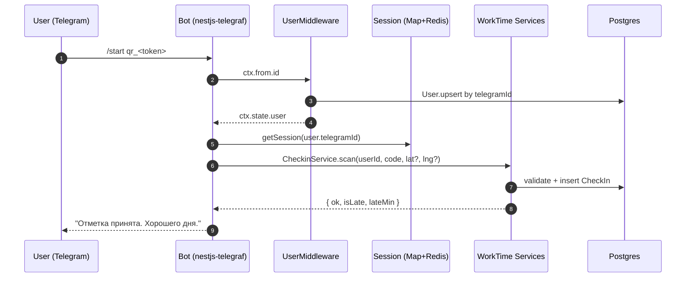
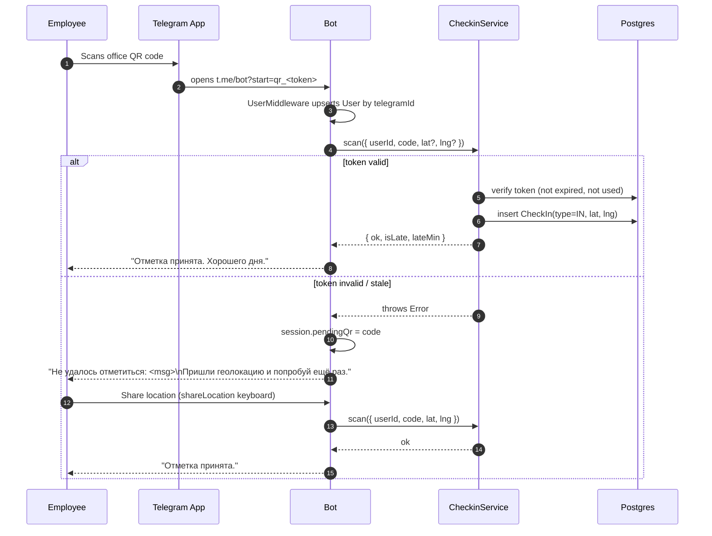
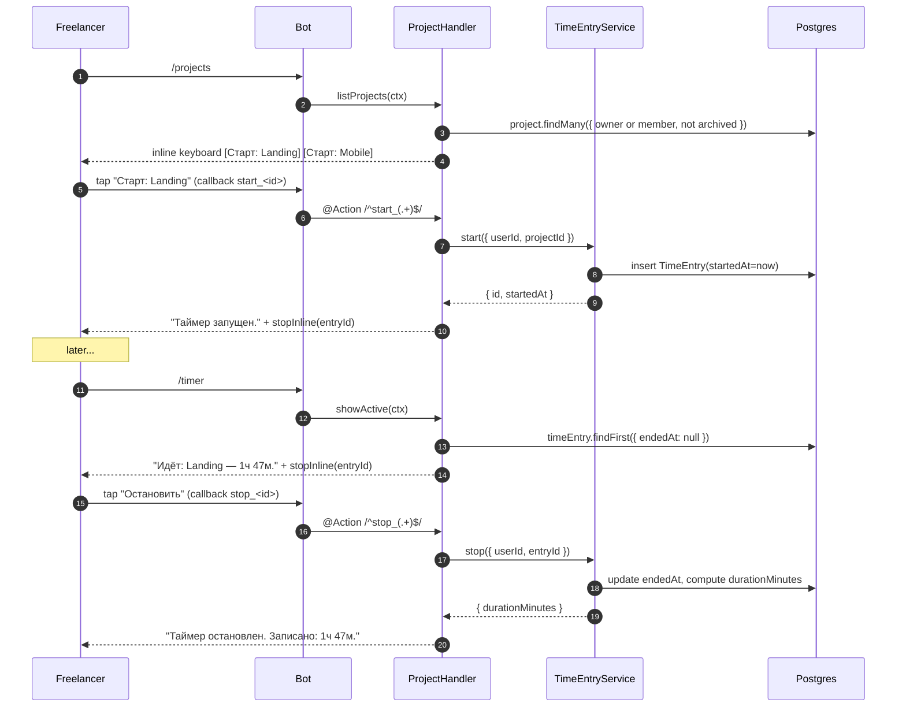
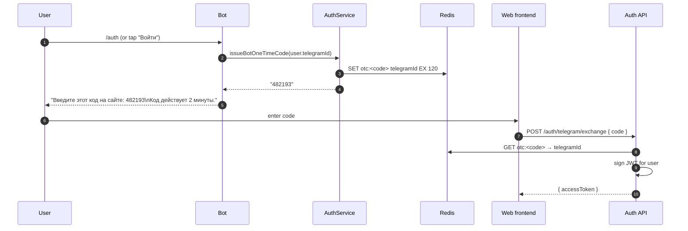

# Telegram Bot

WorkTime bot (`@<TELEGRAM_BOT_USERNAME>`) is the primary UI for end-users. All
app features are accessible via the bot — the web frontend is supplementary
(dashboards, QR display, company admin). The bot is implemented with
[`nestjs-telegraf`](https://github.com/bukhalo/nestjs-telegraf) and lives in
`backend/src/modules/telegram`.

## Setup with BotFather

Step-by-step:

1. Open [@BotFather](https://t.me/BotFather) and run `/newbot`.
2. Choose a name (e.g. `WorkTime`) and a unique username
   (e.g. `worktime_aone_bot`).
3. Copy the issued token into your deployment env as `TELEGRAM_BOT_TOKEN`.
4. Run `/setcommands` → pick the bot → paste:

   ```
   start - Start / connect account
   auth - Get a 6-digit login code
   checkin - Clock in/out at the office
   projects - List and start project timers
   timer - Show active timer
   stats - Monthly stats
   ```

5. `/setdomain` → your web domain (for Login Widget on the frontend).
6. `/setjoingroups` → **Disable** (the bot is 1:1 only).
7. `/setinline` → **Disable** (no inline queries are handled).
8. `/setprivacy` → **Enable** — the bot only needs to see commands and
   @mentions in its own chats.
9. Optional: `/setdescription` and `/setabouttext` — set to your product copy
   (Russian primary, English acceptable).

Once the token is deployed, the bot starts in long-polling mode by default
(dev) or webhook mode if `TELEGRAM_WEBHOOK_URL` is configured (prod).

## Architecture



All handlers share three cross-cutting pieces:

- **`UserMiddleware`** (`middleware/user.middleware.ts`) — resolves or creates
  the `User` row for `ctx.from.id` and attaches it to `ctx.state.user` before
  any handler runs. A missing `from` short-circuits to `next()` without a
  user.
- **Session store** (`session.ts`) — a synchronous `Map<string, TelegramSession>`
  with a Redis write-through Proxy. Handlers mutate `session.lastLocation` or
  `session.pendingQr` as if it were a plain object; writes are persisted to
  Redis in the background with a 24 h TTL.
- **`TelegramErrorsFilter`** (`handlers/errors.filter.ts`) — `@Catch()` filter
  registered via `@UseFilters()` on every `@Update()` class. Logs the
  exception and replies with a single neutral Russian error line; secondary
  reply failures are swallowed.

## Handlers

| Handler           | Decorator / Trigger                                    | Purpose                                                                |
| ----------------- | ------------------------------------------------------ | ---------------------------------------------------------------------- |
| `StartHandler`    | `@Start()` — `/start [payload]`                        | Welcome, parse `qr_<token>` / `inv_<token>` deep-link, render main menu |
| `AuthHandler`     | `@Command('auth')`, `@Hears(/^(Войти\|Login)$/i)`      | Issue a 6-digit one-time code for website login (valid 2 min)          |
| `CheckinHandler`  | `@Command('checkin')`, `@Hears(...)`, `@On('location')`| Prompt for QR scan, capture location, combine pending QR + location    |
| `ProjectHandler`  | `@Command('projects')`, `@Command('timer')`, `@Hears(...)`, `@Action(/^start_(.+)$/)`, `@Action(/^stop_(.+)$/)` | List projects, start/stop timers, show active timer |
| `StatsHandler`    | `@Command('stats')`, `@Hears(/^(Статистика\|Stats)$/i)`| Monthly summary — B2B (company view) or B2C (freelancer view)         |
| `TelegramErrorsFilter` | `@Catch()`                                        | Top-level catch-all exception handler                                  |

Handlers are discovered by `nestjs-telegraf` via `@Update()` on each class.
`TelegramModule` imports `AuthModule`, `CompanyModule`, `CheckinModule`,
`ProjectModule`, `TimeEntryModule` so the handlers can inject their services.

## Deep Links

Deep links are Telegram's standard `t.me/<bot>?start=<payload>` format. The
payload arrives as `ctx.startPayload` and is dispatched inside
`StartHandler.start()`.

- **`t.me/<bot>?start=qr_<token>`** — printed as the office QR code. Scanning
  it on a phone opens Telegram and immediately triggers the `/start` handler
  with `payload = qr_<token>`. The handler calls
  `CheckinService.scan({ userId, code, lat?, lng? })`. If the user has sent a
  recent geolocation, its coordinates are included. On failure, the code is
  stashed in `session.pendingQr` and the user is asked to share location;
  `CheckinHandler.@On('location')` then retries automatically.
- **`t.me/<bot>?start=inv_<token>`** — generated by a company admin when
  inviting a new employee. `StartHandler` calls
  `InviteTokenService.consume(token, userId)` and upserts the corresponding
  `Employee` row with the `role`, `position`, `monthlySalary`,
  `hourlyRate` embedded in the invite claim. On success the user is welcomed
  with the B2B main menu.

Unknown payloads (or none at all) fall through to the default welcome, which
renders `mainMenu(role)` where `role` is derived from the user's current
company / freelancer status.

## Session Model

Implemented in `session.ts`:

```ts
interface TelegramSession {
  lastLocation?: { lat: number; lng: number; at: number };
  pendingQr?: string;
}
```

- In-memory `Map<string, TelegramSession>` keyed by `telegramId.toString()`.
- When `REDIS_URL` is set, `registerSessionRedis()` is called on module init
  with the shared `RedisService`. Reads hydrate once from Redis on first
  access; writes go through a `Proxy` `set` trap that `JSON.stringify`s the
  snapshot (with `bigint` → `string` coercion) and `set`s it under
  `tg:session:<telegramId>` with TTL `60*60*24` seconds.
- `clearSession(telegramId)` drops both in-memory entries (`store`, `raws`,
  `hydrated`) and deletes the Redis key.
- Without Redis the store simply behaves as a plain in-memory object —
  sessions reset on restart.

Handlers use only two keys on the session:

| Key            | Written by        | Read by           | Purpose                                        |
| -------------- | ----------------- | ----------------- | ---------------------------------------------- |
| `lastLocation` | `CheckinHandler`  | `StartHandler`    | Piggyback geolocation onto the next QR scan    |
| `pendingQr`    | `StartHandler`    | `CheckinHandler`  | Retry a QR that failed due to missing location |

## Keyboards

Defined in `keyboards.ts`:

- **`mainMenu(role)`** — persistent reply keyboard (`Markup.keyboard(...).resize()`).
  The button set depends on `role`:
  - `b2b` → `[[ 'Отметиться' ], [ 'Статистика', 'Войти' ]]`
  - `b2c` → `[[ 'Проекты', 'Таймер' ], [ 'Статистика', 'Войти' ]]`
  - `both` → all rows combined.
  The role is computed by `resolveRole(user)` in `start.handler.ts` from
  `user.companyId` / `user.employee` (B2B) and
  `user.clientProfile` / `user.isFreelancer` (B2C).
- **`shareLocation()`** — one-time reply keyboard with a single
  `Markup.button.locationRequest('Отправить геолокацию')` button. Sent by
  `CheckinHandler.prompt()`.
- **`projectsInline(projects)`** — one row per project, each
  `Markup.button.callback('Старт: <name>', 'start_<id>')`. Sent by
  `ProjectHandler.listProjects()`.
- **`stopInline(entryId)`** — single inline button
  `Markup.button.callback('Остановить', 'stop_<entryId>')`. Sent after
  `start_<id>` fires and by `/timer`.
- **`confirmInline(action, id)`** — generic Yes/Cancel pair with callback
  data `confirm_<action>_<id>` and `cancel_<action>_<id>`. Available for
  future confirmation flows (currently unused by shipped handlers).

Button labels are Russian-first; `@Hears` regexes on every handler also
accept the English equivalents (`Login`, `Check in`, `Projects`, `Timer`,
`Stats`) so localisation can be added later without renaming callbacks.

## Flow Diagrams

### B2B Check-in Flow



### B2C Timer Flow



### Website Login (OTC) Flow



## Localization

Primary Russian; fallback English supported only on reply keyboard triggers
via `@Hears` regex (`/^(Войти|Login)$/i`, `/^(Отметиться|Check\s?in)$/i`,
etc.). All `ctx.reply(...)` bodies are Russian editorial copy — short, no
emoji spam, no exclamation marks. When in doubt, mirror the tone already set
by `start.handler.ts`: factual, second-person-singular («ты»), neutral.

## Error Handling

- Every `@Update()` class is decorated with
  `@UseFilters(TelegramErrorsFilter)`.
- The filter uses `TelegrafArgumentsHost.create(host).getContext<Context>()`
  to obtain the Telegraf context, logs `exception.message` via a `Logger`
  (Nest → Pino in prod), and replies with
  `«Что-то пошло не так, попробуй позже.»`.
- Secondary `ctx.reply()` failures (user blocked the bot, etc.) are swallowed
  so the filter itself never throws.
- Callback-query-style errors inside `ProjectHandler` use
  `ctx.answerCbQuery(msg.slice(0, 190))` directly — Telegram caps callback
  alerts at 200 characters.

## Webhook vs Polling

- **Dev**: long-polling by default. `TelegrafModule.forRootAsync` registers
  with `token: TELEGRAM_BOT_TOKEN` and no `launchOptions`, so Telegraf starts
  `bot.launch()` with polling.
- **Prod**: set `TELEGRAM_WEBHOOK_URL=https://api.your-domain.kz/api/telegram/webhook`.
  `nestjs-telegraf` registers the webhook at bootstrap and mounts the
  receiver route. Nginx must forward `POST /api/telegram/webhook` to the
  Nest app; the rest of the API surface sits alongside it at `/api/...`.
- Switching modes requires a restart. Leaving `TELEGRAM_WEBHOOK_URL` unset
  in prod is a common misconfiguration — the bot will silently fall back to
  polling and race any other replica that also starts polling.

## Security

- `UserMiddleware` resolves users by `ctx.from.id` (coerced to `BigInt`) and
  upserts on first contact. Every handler re-reads `ctx.state.user` and
  returns early with a neutral «Сначала выполни /start.» if it is missing.
- One-time codes issued by `AuthService.issueBotOneTimeCode()` live in Redis
  for **2 minutes** and are **single-use** — the exchange endpoint `DEL`s
  the key on read.
- Telegram WebApp `initData` (used by any future Web App views) must be
  verified via `HMAC-SHA256(secret_key = HMAC_SHA256('WebAppData', botToken), dataCheckString)`
  before trusting `initData.user`. Never trust client-sent `telegram_id`.
- Never log `initData`, OTC codes, invite tokens, or raw location
  coordinates. The logger line in `UserMiddleware` only surfaces
  `(err as Error).message`.
- Deep-link tokens (`qr_`, `inv_`) are treated as bearer secrets — they are
  only valid within their short TTL and are marked as consumed in the
  respective service on success.

## Testing

- **Unit**: handlers are plain classes; mock `Context` with the minimum
  surface (`reply`, `answerCbQuery`, `state`, `message`, `match`) and assert
  on the recorded calls. See `backend/test` for existing patterns.
- **Session**: `getSession()` is synchronous and has no DI — in tests,
  leave `registerSessionRedis(null)` (the default) to run with the
  in-memory fallback and a clean `Map` per test file.
- **Manual**: open `@<your_bot>` in Telegram Desktop, run the smoke flow in
  `docs/TROUBLESHOOTING.md` (`/start` → `/auth` → `/projects` → start →
  `/timer` → stop → `/stats`).

## Troubleshooting

| Symptom | Likely cause | Fix |
| --- | --- | --- |
| `Unauthorized (401)` from API | `User` not resolved in middleware | Verify `UserMiddleware` runs before handlers and that `ctx.from.id` is present |
| "Invalid token" on QR scan | Token expired or already consumed by the same employee | Wait for next rotation or re-print QR |
| Bot does not respond | `TELEGRAM_BOT_TOKEN` missing/wrong, or Telegram API unreachable (corp proxy, firewall) | Re-issue token via BotFather; check egress to `api.telegram.org:443` |
| Keyboard does not change between b2b/b2c | Session not persisted — `REDIS_URL` unset on a multi-replica deploy | Set `REDIS_URL`; restart; role is also recomputed on every `/start` from DB |
| Duplicate replies in prod | Two replicas polling at once | Switch to webhook mode or run the bot in a single-replica Nest instance |
| "Приглашение недействительно" | `InviteTokenService.consume` rejected the token (expired/used/invalid) | Regenerate invite from company admin |
| Location never reaches the bot | User declined the `shareLocation` request, or client stripped location | Re-prompt via `/checkin`; QR still works without coordinates if the token is valid |

## Related files

- `backend/src/modules/telegram/telegram.module.ts` — wiring, imports,
  `registerSessionRedis` bootstrap hook.
- `backend/src/modules/telegram/bot.service.ts` — `BotService.notifyUser()`
  exported for other modules to push messages (e.g. reminders, late alerts).
- `backend/src/modules/telegram/middleware/user.middleware.ts` — user
  upsert-by-telegramId.
- `backend/src/modules/telegram/session.ts` — in-memory + Redis session
  store.
- `backend/src/modules/telegram/keyboards.ts` — all reply and inline
  keyboards.
- `backend/src/modules/telegram/handlers/*.handler.ts` — one class per
  feature area.
- `backend/src/modules/telegram/handlers/errors.filter.ts` — global
  exception filter.
